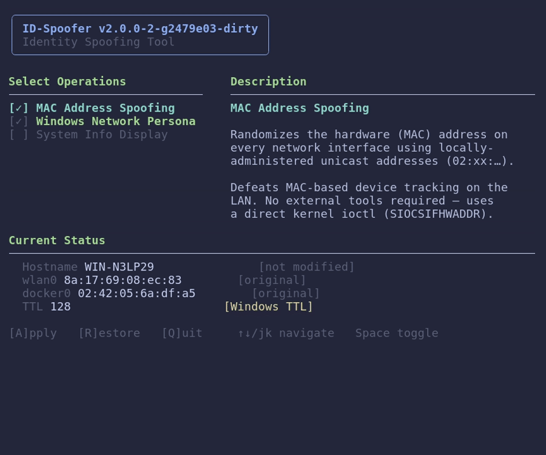
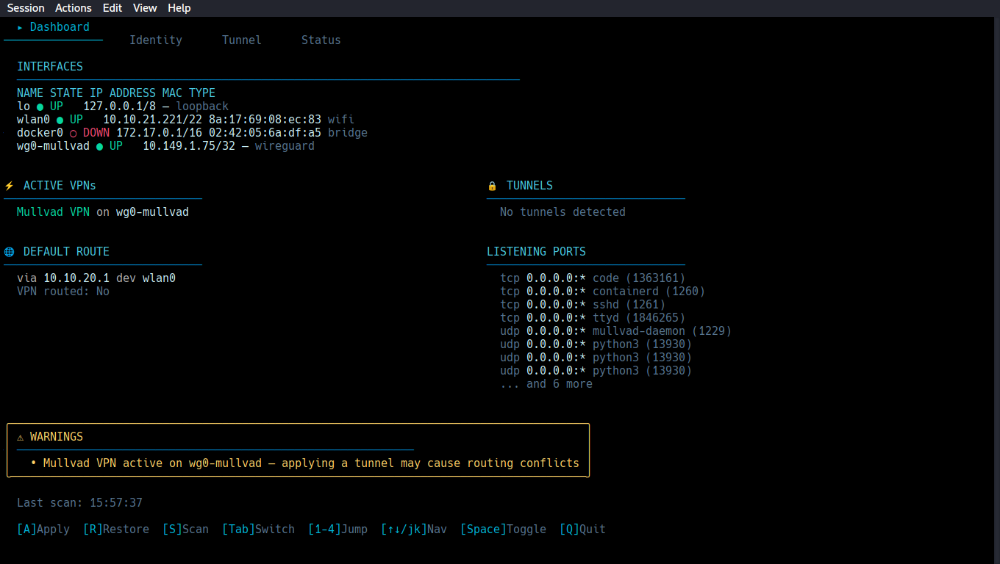
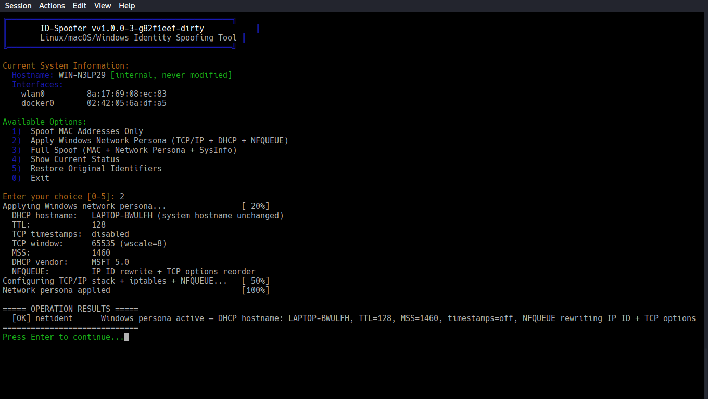
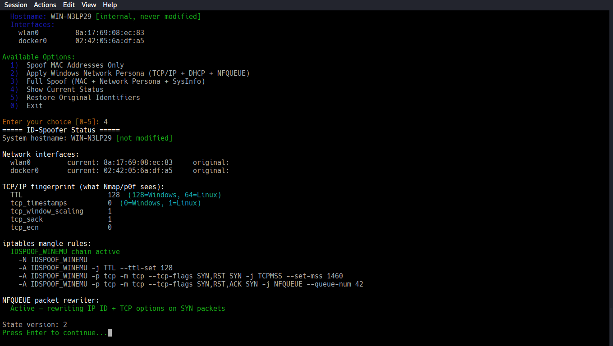
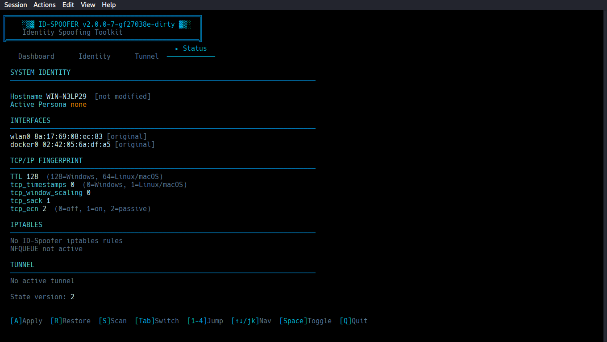

<div align="center">
  

# ID-Spoofer v2.0.5


[](https://pkg.go.dev/github.com/NubleX/ID-Spoofer/idspoof)

</div>

A cross-platform identity spoofing toolkit for penetration testing and security assessments. Written in Go, ID-Spoofer randomizes MAC addresses and projects a convincing OS network persona (Windows, macOS, or iOS) at the wire level — without touching the system hostname or breaking internal configuration. Optional protocol encapsulation routes traffic through Tor, WireGuard, I2P, Shadowsocks, QUIC tunnels, or layered combinations.

## Demo

<div align="center">
  
  <br/>
  <sub><b>ID-Spoofer</b> — Multi-OS TCP/IP identity projection + protocol encapsulation, wire-level, zero hostname changes &nbsp;·&nbsp; <a href="https://www.idarti.com">idarti.com</a></sub>
</div>

## Screenshots

<div align="center">

**New Dashboard 2.0.5**


---

**Applying Network Persona**


*DHCP hostname injected, TTL set, MSS=1460, NFQUEUE rewriting IP ID + TCP options. System hostname unchanged.*

---

**Status — Persona Active**


*`idspoof status` after apply: IDSPOOF_NETEMU chain dumped, NFQUEUE rewriter confirmed active on queue 42.*

---

**Status — Clean State**


*Before apply: sysctl already at Windows values (TTL=128, timestamps=0) but no iptables rules and NFQUEUE not running.*

</div>

## How it works

The key design principle: **your system hostname is never modified**. Instead, ID-Spoofer manipulates the network stack so that passive observers (p0f, Nmap, Wireshark) see a different operating system.

### Network personas

Five personas are available, each projecting a different OS identity at the wire level:

| Persona | TTL | TCP Timestamps | Window Scale | TCP Options Order | DHCP Vendor Class | mDNS |
|---------|-----|----------------|--------------|-------------------|-------------------|------|
| **Windows** (default) | 128 | Disabled | 8 | MSS, NOP, WS, NOP, NOP, SOK | `MSFT 5.0` | Avahi stopped |
| **macOS** | 64 | Enabled | 8 | MSS, NOP, WS, NOP, NOP, TS, SOK | None | Avahi left running |
| **Linux** | 64 | Enabled | 7 | MSS, SACK, TS, NOP, WS | None | Avahi left running |
| **iOS** | 64 | Enabled | 16 | MSS, NOP, WS, NOP, NOP, TS, SOK | None | Avahi left running |
| **Android** | 64 | Enabled | 8 | MSS, SACK, TS, NOP, WS | None | Avahi left running |

### Network persona layers

When you run `idspoof apply`, five layers activate simultaneously:

| Layer | What changes | Effect |
|-------|-------------|--------|
| **sysctl** | TTL, tcp_timestamps, tcp_sack, tcp_ecn, window buffers | Kernel-level TCP/IP parameters matching the selected OS |
| **iptables** | `IDSPOOF_NETEMU` mangle chain | Forces correct TTL on outgoing packets, clamps MSS=1460 on SYN |
| **NFQUEUE** (queue 42) | Intercepts outgoing SYN packets | Rewrites IP ID (Linux=0 → incrementing) and reorders TCP options to match OS layout |
| **DHCP** | Option 12 (hostname) + Option 60 (vendor class, Windows only) | Router sees appropriate hostname (e.g., `DESKTOP-A1B2C3D` or `Admins-MacBook-Pro`) |
| **mDNS** | Stops Avahi (Windows) or leaves it running (macOS/iOS) | Controls hostname visibility on local network |

The NFQUEUE rewriter is pure Go with no CGo and no external C libraries. It builds TCP options in the exact order the target OS uses, including Timestamps for macOS/iOS personas.

**p0f signatures after apply:**
- Windows: `*:128:0:*:65535,8:mss,nop,ws,nop,nop,sok:df,id+:0`
- macOS: `*:64:0:*:65535,8:mss,nop,ws,nop,nop,ts,sok,eol+1:df,id+:0`
- Linux: `*:64:0:*:29200,7:mss,sackOK,ts,nop,ws:df,id+:0`
- iOS: `*:64:0:*:65535,16:mss,nop,ws,nop,nop,ts,sok,eol+1:df,id+:0`
- Android: `*:64:0:*:65535,8:mss,sackOK,ts,nop,ws:df,id+:0`

### Protocol encapsulation

Optional tunnel support routes all traffic through an encrypted protocol. Each tunnel wraps an existing system binary — ID-Spoofer manages lifecycle and iptables rules.

| Tunnel | Binary Required | Transparent Mode | SOCKS Mode | Notes |
|--------|----------------|------------------|------------|-------|
| **Tor** | `tor` | iptables redirect to TransPort 9040 | SOCKS5 on 127.0.0.1:9050 | Anonymity network, multi-hop onion routing |
| **WireGuard** | `wg-quick` | Default route via wg0 | N/A | Fast kernel-level VPN |
| **I2P** | `i2pd` | HTTP/HTTPS via outproxy | SOCKS5 on :4447, HTTP on :4444 | Garlic routing, hidden services |
| **Shadowsocks** | `sslocal` or `ss-local` | iptables redirect to redir :1081 | SOCKS5 on 127.0.0.1:1080 | AEAD proxy, censorship evasion |
| **QUIC** | `hysteria` | iptables redirect via tproxy | SOCKS5 on 127.0.0.1:1080 | Hysteria2 UDP tunnel, anti-DPI |
| **LWO** | `wg-quick` + `obfs4proxy` | Default route via wg-obfs0 | N/A | WireGuard with obfuscation headers |
| **Tor over VPN** | `tor` + `wg-quick` | VPN first → Tor through it | — | ISP sees VPN, VPN sees Tor entry |
| **VPN over Tor** | `tor` + `wg-quick` | Tor first → VPN through Tor | — | ISP sees Tor, VPN never knows real IP |

Tunnels run in two modes:
- **Transparent** (default): all system traffic is automatically redirected through the tunnel via iptables
- **SOCKS**: a local SOCKS5 proxy is exposed; configure applications manually

## Requirements

- Linux (Phases 5–6 will add macOS and Windows support)
- Root privileges
- `iproute2` — interface management
- `iptables` — packet mangling rules
- NetworkManager or dhclient — DHCP hostname injection
- Optional: `avahi-daemon` (stopped during Windows persona)

**For tunnels** (install only what you need):
- `tor` — Tor anonymity network
- `wg-quick` — WireGuard VPN
- `i2pd` — I2P garlic routing
- `sslocal` or `ss-local` — Shadowsocks proxy
- `hysteria` — QUIC tunnel (Hysteria2)
- `obfs4proxy` — LWO obfuscation layer

## Installation

### From binary (recommended)

```bash
# Download the latest release for your platform
curl -sL https://github.com/NubleX/ID-Spoofer/releases/latest/download/idspoof_linux_amd64 -o idspoof
chmod +x idspoof
sudo mv idspoof /usr/local/bin/
```

### Build from source

```bash
git clone https://github.com/NubleX/ID-Spoofer.git
cd id-spoofer/idspoof
make build
sudo cp bin/idspoof /usr/local/bin/
```

Go 1.22+ required. If Go is not installed:

```bash
curl -sL https://go.dev/dl/go1.22.4.linux-amd64.tar.gz | tar -xz -C ~/.go --strip-components=1
export PATH="$HOME/.go/bin:$PATH"
```

## Usage

All commands require root.

```bash
# Full identity spoof: MAC + Windows network persona + sysinfo
sudo idspoof apply

# Choose a different persona
sudo idspoof apply --persona macos
sudo idspoof apply --persona linux
sudo idspoof apply --persona ios

# MAC addresses only
sudo idspoof apply --mac-only

# Network persona only (TCP/IP + DHCP + NFQUEUE)
sudo idspoof apply --netident-only

# Add a tunnel (transparent mode by default)
sudo idspoof apply --tunnel tor
sudo idspoof apply --tunnel wireguard --tunnel-config /etc/wireguard/wg0.conf
sudo idspoof apply --tunnel shadowsocks --tunnel-config ~/ss.json --tunnel-mode socks

# Layered tunnels
sudo idspoof apply --tunnel tor-over-vpn --tunnel-config /etc/wireguard/wg0.conf
sudo idspoof apply --tunnel vpn-over-tor --tunnel-config /etc/wireguard/wg0.conf

# Preview changes without applying
sudo idspoof apply --dry-run

# Show current state vs saved originals
sudo idspoof status

# Roll back everything (persona + MAC + tunnel)
sudo idspoof restore

# Roll back only MAC addresses
sudo idspoof restore --mac

# Roll back only network persona
sudo idspoof restore --netident

# Interactive TUI menu
sudo idspoof menu

# Version info
idspoof version
```

### Apply flags

```
--persona windows|macos|linux|ios|android   Network persona to project (default: windows)
--tunnel PROTOCOL             Tunnel protocol: tor, wireguard, i2p, shadowsocks, quic, lwo,
                              tor-over-vpn, vpn-over-tor
--tunnel-mode MODE            transparent (default) or socks
--tunnel-config PATH          Config file for the tunnel (WireGuard .conf, Shadowsocks .json, etc.)
```

### Global flags

```
--quiet        Suppress output, skip confirmations
--debug        Verbose logging
--log FILE     Log to file
--state-dir    State directory (default: /var/log/idspoof)
```

### Verifying the persona

Use tcpdump or Wireshark to capture a SYN packet and inspect:
- **Windows:** TTL=128, no timestamps, options: MSS → NOP → WScale → NOP → NOP → SACKPermitted
- **macOS:** TTL=64, timestamps present, options: MSS → NOP → WScale → NOP → NOP → Timestamps → SACKPermitted
- **Linux:** TTL=64, timestamps present, options: MSS → SACK → Timestamps → NOP → WScale (kernel default order)
- **iOS:** Same as macOS but window scale factor 16 instead of 8

```bash
sudo tcpdump -i any -nn 'tcp[tcpflags] & tcp-syn != 0' -X
```

## State management

State is stored in `/var/log/idspoof/state.env` — an atomic key=value file backward-compatible with the v1 Bash format. Keys include `ORIG_MACS`, `ORIG_TTL`, `ORIG_TCP_TIMESTAMPS`, and related sysctl originals. `restore` uses these to fully roll back.

## Architecture

The Go rewrite (`idspoof/`) replaces the original Bash scripts with a structured, cross-platform binary:

```
cmd/idspoof/          CLI commands (cobra): apply, restore, status, menu, version
internal/
  mac/                MAC generation and Linux interface manipulation
  netident/           Multi-OS network persona: sysctl, iptables, NFQUEUE, DHCP, mDNS
  tunnel/             Protocol encapsulation: Tor, WireGuard, I2P, Shadowsocks, QUIC, combos
  spoofer/            Orchestrator: runs selected operations, collects results
  state/              Atomic key=value state file (bash v1 compatible)
  platform/           Platform abstraction + privilege checks
  ui/                 Banner, colors, confirm prompt, progress
  sysinfo/            Fake hardware profile generation (display-only)
legacy/               Original Bash scripts preserved for reference
```

The original Bash toolkit is preserved in `legacy/` and in the `master` branch history.

## Roadmap

- [x] Phase 1–2: Go core + Linux MAC/netident/sysinfo
- [x] Phase 3: CLI commands (apply, restore, status, menu)
- [x] Phase 4: Multi-OS personas (Windows, macOS, iOS, Android) + protocol encapsulation (8 tunnel protocols)
- [x] Phase 5: macOS native (ifconfig, scutil, sysctl net.inet.ip.ttl)
- [x] Phase 6: Windows native (registry MAC, WMI hostname, Tcpip\Parameters)
- [x] Phase 7: GitHub Actions CI + goreleaser multi-platform releases

## Acknowledgements

Thanks to the teams whose open-source work makes this possible:

- **[Charm](https://github.com/charmbracelet)** — [Bubble Tea](https://github.com/charmbracelet/bubbletea) and [Lip Gloss](https://github.com/charmbracelet/lipgloss) power the interactive TUI. Genuinely excellent libraries.
- **[spf13/cobra](https://github.com/spf13/cobra)** — the CLI framework behind every subcommand.
- **[pythops/oryx](https://github.com/pythops/oryx)** — TUI network traffic monitor whose design inspired the Traffic tab's live bandwidth and connection display.

## Legal disclaimer

For penetration testing on systems you own or have explicit written permission to test, security research, and authorized red team assessments only. Users are responsible for compliance with applicable laws.

---

Visit https://www.idarti.com
