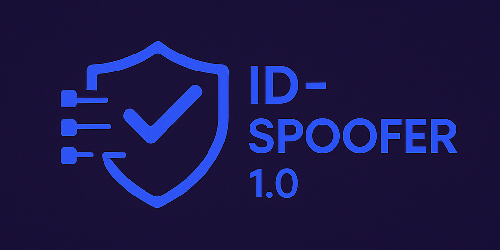

<div align="center">
  

# Linux Identity Spoofer v1.0


</div>

A comprehensive toolkit for spoofing hardware identifiers, MAC addresses, and system fingerprints to enhance anonymity during penetration testing and security assessments.

## Features

- **MAC Address Spoofing**: Randomize MAC addresses for all network interfaces
- **Hostname Modification**: Generate random Windows-like hostnames
- **OS Fingerprint Obfuscation**: Modify TCP/IP stack parameters to appear like Windows
- **System Information Spoofing**: Simulated hardware profile changes
- **Graphical Interface**: GUI support when available, with fallback to CLI
- **Modular Operation**: Run complete identity change or specific components
- **Interactive Menu**: User-friendly menu system for easy operation
- **Logging Support**: Optional logging of all actions
- **Quiet Mode**: Silent operation for automated scripts

## Requirements

- Linux distribution (tested on Kali Linux, Ubuntu, Debian)
- Root privileges
- bash shell
- Core utilities: `macchanger`, `net-tools`, `iproute2`
- Optional GUI components: `zenity`, `libnotify-bin`

## Installation

### Quick Install

```bash
# Clone the repository
git clone https://github.com/nublex/id-spoofer.git
cd id-spoofer

# Run the installer
sudo ./install.sh
```

### Manual Installation

```bash
# Install dependencies
sudo apt-get update
sudo apt-get install -y macchanger net-tools iproute2 zenity libnotify-bin

# Make scripts executable
chmod +x src/bin/*.sh
chmod +x install.sh

# Install manually
sudo cp src/bin/hardware-spoof.sh /usr/local/bin/
sudo cp src/bin/idspoof-menu.sh /usr/local/bin/
sudo chmod +x /usr/local/bin/hardware-spoof.sh
sudo chmod +x /usr/local/bin/idspoof-menu.sh
sudo ln -sf /usr/local/bin/hardware-spoof.sh /usr/local/bin/idspoof
```

## Usage

### Command Line Interface

#### Basic Usage

```bash
# Full identity spoofing (interactive)
sudo idspoof

# Full identity spoofing with GUI
sudo idspoof --gui

# Spoof only MAC addresses
sudo idspoof --mac-only

# Spoof only hostname
sudo idspoof --hostname-only

# Silent operation (no prompts)
sudo idspoof --quiet

# With logging
sudo idspoof --log /var/log/idspoof.log
```

#### Interactive Menu

```bash
# Launch interactive menu
sudo idspoof-menu.sh
```

### Available Options

| Option | Description |
|--------|-------------|
| `--gui` | Use GUI elements if available |
| `--mac-only` | Only spoof MAC addresses |
| `--hostname-only` | Only spoof hostname |
| `--quiet` | No interactive prompts or output |
| `--log FILE` | Log actions to specified file |
| `--help` | Show help message |

## Use Cases

- **Penetration Testing**: Evade network monitoring and detection systems
- **Privacy Enhancement**: Reduce trackable hardware fingerprints
- **Security Research**: Test network security and monitoring capabilities
- **Digital Forensics**: Simulate different system configurations
- **Red Team Operations**: Maintain operational security during assessments

## ⚠️ Legal Disclaimer

This tool is intended for:

- ✅ Penetration testing on systems you own or have explicit permission to test
- ✅ Educational purposes and security research
- ✅ Protecting your privacy on your own systems
- ✅ Authorized security assessments

**Do NOT use this tool for:**

- ❌ Unauthorized access to systems
- ❌ Illegal activities or malicious purposes
- ❌ Circumventing security measures without permission

Users are responsible for ensuring their use complies with all applicable laws and regulations.

## Technical Details

### MAC Address Spoofing

- Generates random MAC addresses with vendor-neutral prefixes
- Supports all network interfaces except loopback
- Safely disables/enables interfaces during the process

### Hostname Spoofing

- Creates Windows-like hostnames (WIN-XXXXXX, PC-XXXXXX, etc.)
- Updates `/etc/hostname` and `/etc/hosts`
- Maintains system consistency

### OS Fingerprint Modification

- Modifies TCP/IP stack parameters:
  - Sets TTL to 128 (Windows-like)
  - Disables TCP timestamps
  - Disables TCP window scaling

### System Profile Spoofing

- Simulates hardware manufacturer information
- Generates realistic system identifiers
- Creates temporary profile data

## Troubleshooting

### Common Issues

**"Permission denied" errors:**

```bash
# Ensure you're running as root
sudo idspoof
```

**Missing dependencies:**

```bash
# Reinstall dependencies
sudo apt-get install -y macchanger net-tools iproute2
```

**Network connectivity issues after spoofing:**

```bash
# Restart network manager
sudo systemctl restart NetworkManager
# Or restore original MAC addresses
sudo idspoof-menu.sh  # Option 5
```

**GUI components not working:**

```bash
# Install GUI dependencies
sudo apt-get install -y zenity libnotify-bin
```

### Debug Mode

```bash
# Run with verbose output
bash -x /usr/local/bin/hardware-spoof.sh
```

## 📝 Changelog

### Version 1.0.0 (2025-06-06)

- ✨ Initial stable release
- ✨ Complete MAC address spoofing functionality
- ✨ Hostname randomization with Windows-like patterns
- ✨ OS fingerprint obfuscation
- ✨ GUI support with zenity integration
- ✨ Interactive menu system
- ✨ Logging capabilities
- ✨ Quiet mode for automation
- ✨ Comprehensive error handling
- ✨ Desktop integration
- 🐛 Fixed network interface detection
- 🐛 Improved error handling for missing dependencies
- 📚 Enhanced documentation and help system

## Contributing

Contributions are welcome! Please feel free to submit a Pull Request. For major changes, please open an issue first to discuss what you would like to change.

### Development Setup

```bash
git clone https://github.com/nublex/id-spoofer.git
cd id-spoofer
# Make your changes
# Test thoroughly on a safe system
# Submit a pull request
```

## License

This project is licensed under the GNU General Public License v3.0 - see the [LICENSE](LICENSE) file for details.

## Acknowledgments

- The open-source security community
- Contributors to the macchanger project
- Linux kernel networking stack developers

## Support

- **Issues**: [GitHub Issues](https://github.com/nublex/id-spoofer/issues)
- **Discussions**: [GitHub Discussions](https://github.com/nublex/id-spoofer/discussions)
- **Security Issues**: Please report responsibly via private channels

---

## Made with ❤️ for the cybersecurity community
